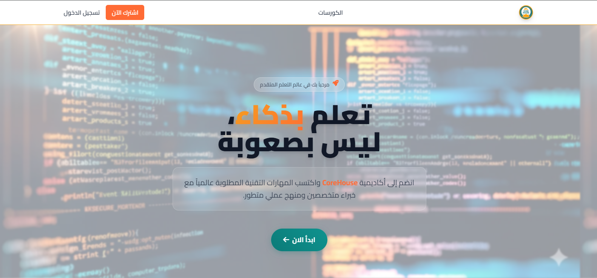
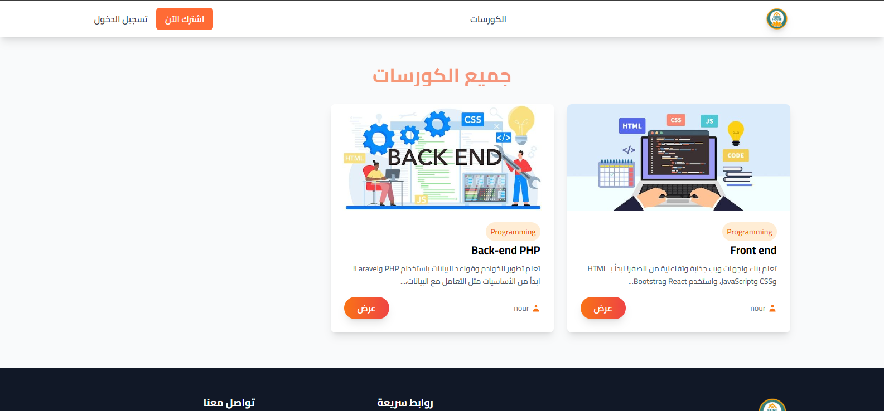

# 🏠 CoreHouse Academy

  
  
  
  

## 📖 About The Project

**CoreHouse Academy** is an advanced educational platform built with Laravel that aims to provide an exceptional learning experience for students and teachers. The platform supports course management, lessons, and educational content in an easy and effective way.

## 🎨 Project Screenshots

  

  

---

  Made with ❤️ by Nour

